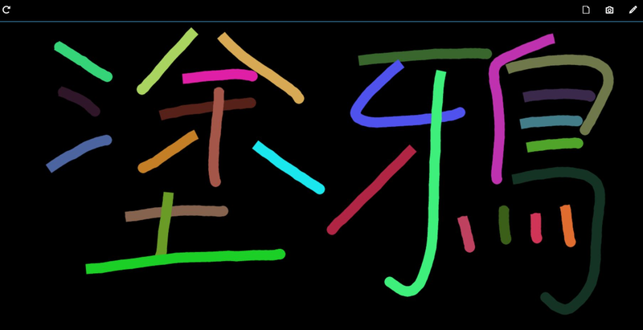

# Tuya

* A simple drawing pad using HTML5

## Features

* save the draw history and share with your friends
* various colors, brushes and paint styles
* draw anytime, replay the draw history anywhere
* free, no advertisements and open source

## Platform

* support Windows 8.1, Windows Phone 8.1, Android, Firefox OS, Chrome OS and all the recent web browsers

## Language

* support fourteen langueages, including english, 中文, 日本の, 한국의, português, español, हिन्दी, العربية‎ , русский язык, le français , อักษรไทย, Deutsch, Italiano

## Demo

* http://tinyurl.com/knxtpd8

## External Library

* App Framework 2.1 
* https://github.com/01org/appframework

## License

The MIT License
